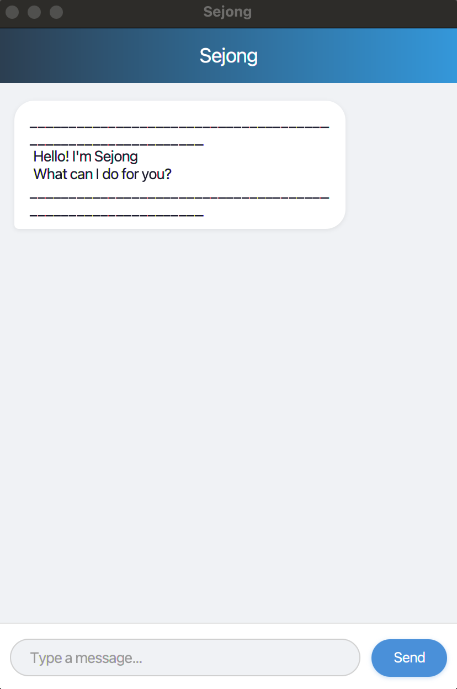

# Sejong User Guide



**Sejong** is a desktop chatbot for managing your tasks. Track todos, deadlines, and events through simple text commands.

## Quick Start

1. Ensure you have **Java 17** installed.
2. Download the latest `sejong.jar`.
3. Run it:
   ```bash
   java -jar sejong.jar
   ```
4. Type a command and press **Enter** or click **Send**.

## Command Summary

| Command | Format | Example |
|---------|--------|---------|
| todo | `todo DESCRIPTION` | `todo read book` |
| deadline | `deadline DESCRIPTION /by DATE` | `deadline essay /by 2024-12-31` |
| event | `event DESCRIPTION /from DATE /to DATE` | `event meeting /from 2024-12-01 /to 2024-12-02` |
| list | `list` | |
| mark | `mark INDEX` | `mark 1` |
| unmark | `unmark INDEX` | `unmark 1` |
| delete | `delete INDEX` | `delete 2` |
| find | `find KEYWORDS [/date DATE] [/type TYPE] [/status STATUS]` | `find book` |
| bye | `bye` | |

> **Note:** All dates use `yyyy-MM-dd` format (e.g. `2024-12-31`). `INDEX` refers to the task number shown by `list`.

## Adding Tasks

### `todo` -- Task with no date

```
todo read book
```

### `deadline` -- Task with a due date

```
deadline return book /by 2024-12-31
```

### `event` -- Task spanning a date range

The start date must not be after the end date.

```
event team meeting /from 2024-12-01 /to 2024-12-02
```

When a task is added, Sejong confirms with:

```
Got it. I've added this task:
  [D][ ] return book (by: Dec 31 2024)
Now you have 2 tasks in the list.
```

Duplicate tasks (same type, description, and dates) are rejected.

## Managing Tasks

### `list` -- View all tasks

```
list
```

```
Here are the tasks in your list:
1.[T][ ] read book
2.[D][ ] return book (by: Dec 31 2024)
3.[E][X] team meeting (from: Dec 01 2024 to: Dec 02 2024)
```

Task icons: `[T]` = todo, `[D]` = deadline, `[E]` = event.
Status icons: `[ ]` = not done, `[X]` = done.

### `mark` / `unmark` -- Toggle completion

```
mark 1
unmark 1
```

### `delete` -- Remove a task

```
delete 2
```

## Finding Tasks

Use `find` with keywords and optional filters. All criteria must match.

```
find book
find /type deadline /status pending
find meeting /date 2024-12-01
```

| Filter | Values | What it does |
|--------|--------|--------------|
| `/date` | `yyyy-MM-dd` | Deadlines due on that date, events spanning it |
| `/type` | `todo`, `deadline`, `event` | Filter by task type |
| `/status` | `done`, `pending` | Filter by completion status |

## Exiting

```
bye
```

Closes the application.

## Data Storage

Tasks are saved automatically to `./data/sejong.txt` and reloaded on startup. Do not edit this file manually -- invalid entries are skipped on load.
